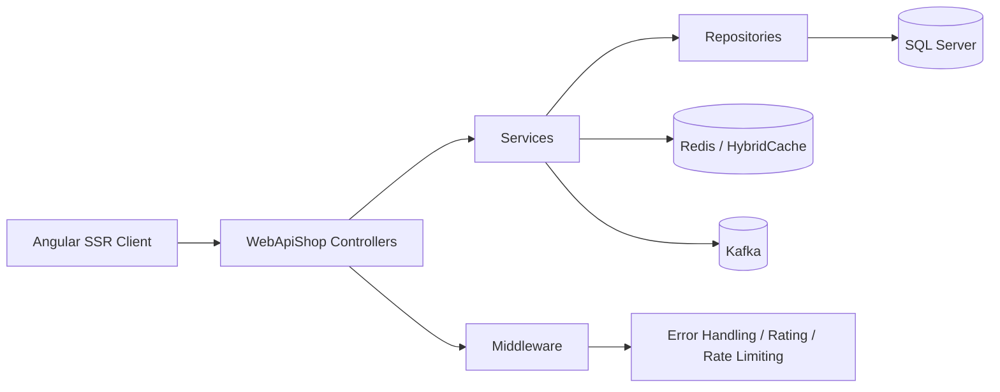

# WebApiShop — ShowsCenter Platform

WebApiShop is a full-stack event-ticketing platform built with **.NET 9** and **Angular 21 SSR**.  
It combines a layered ASP.NET Core API, SQL Server persistence, Redis-backed caching, Kafka event publishing, JWT authentication, email workflows, and a modern Angular client for browsing shows, managing seats, and completing orders.

## What This Project Delivers

- Browse and filter shows with paging, sorting, and category/sector/audience filters.
- Manage providers, categories, sections, images, and show content.
- Reserve seats, create orders, and complete checkout flows.
- Authenticate users with **JWT stored in an HttpOnly cookie**.
- Protect admin-only operations with role-based authorization.
- Cache show queries with **HybridCache + Redis**.
- Publish order activity to **Kafka** for asynchronous processing.
- Send password-reset and order-confirmation emails.
- Rate-limit sensitive endpoints and centralize error handling.
- Store request activity with a lightweight rating/telemetry middleware.

## Architecture

The backend follows a clear layered design:

- `Entities` — EF Core domain model and `ShowsCenterContext`.
- `Repositories` — database access and query composition.
- `Services` — business rules, orchestration, caching, auth, email, and Kafka publishing.
- `WebApiShop` — ASP.NET Core HTTP API, middleware, authentication, Swagger, and static assets.
- `KafkaWorker` — background consumer for Kafka order events.
- `Tests` — unit and integration coverage for repository and security flows.
- `client` — Angular SSR frontend that consumes the API.

### Simple Diagram



### Request Flow

1. The Angular client calls the Web API.
2. Controllers validate HTTP concerns and forward to services.
3. Services apply business rules, map DTOs, and coordinate repositories.
4. Repositories read/write SQL Server via EF Core.
5. Cross-cutting concerns run through middleware and platform services:
   - JWT authentication
   - rate limiting
   - error handling
   - request rating/telemetry
   - Redis caching
   - Kafka publishing

## Backend Highlights

### Authentication & Security

- JWT authentication with bearer support in Swagger and cookie-based token extraction.
- Password hashing with **BCrypt**.
- Password strength validation with **zxcvbn**.
- Manager-guarded endpoints for show/category/provider management.
- Rate limiting for login, signup, password reset, upload, and other sensitive actions.

### Performance & Scalability

- `HybridCache` for cached show listings.
- Redis configured as the distributed cache backing.
- Kafka producer service for order events and checkout messages.
- Background consumer worker for downstream processing.

### Reliability & Observability

- Global exception handler returns structured `ProblemDetails`.
- `RatingMiddleware` records request metadata to the database.
- Health endpoint for quick service checks.
- Swagger/OpenAPI configured for API exploration and JWT authorization.

### Domain Model

Core entities model a show-booking workflow:

- `Show` belongs to a `Provider` and `Category`.
- `Show` has multiple `Sections` and related `OrderedSeats`.
- `Order` belongs to a `User` and contains ordered seats.
- `OrderedSeat` represents a locked/reserved seat and tracks section, row, column, and status.
- `PasswordResetCode` supports the forgotten-password flow.
- `Rating` stores request analytics/telemetry.

## API Surface

Main controller areas:

- `UsersController` — registration, login, manager check, forgot/reset password, order confirmation email.
- `ShowsController` — browse, create, update, delete, and filter shows.
- `CategoryController` — category management.
- `ProviderController` — provider management.
- `SectionController` — seat section management.
- `OrderController` — order creation, checkout, and seat locking/unlocking.
- `OrderedSeatController` — read ordered seats by show or user.
- `PasswordController` — password strength checks.
- `ImagesController` — authenticated image upload to `wwwroot/uploads`.
- `HealthController` — health check endpoint.

## Frontend Highlights

The Angular client is structured around reusable services and standalone components:

- Show browsing, filtering, and detailed show pages.
- Login and signup flows.
- Cart and checkout experience.
- Personal area for user-specific data.
- Admin-oriented add/edit screens for shows, providers, and categories.
- Seat map visualization and reservation handling.
- Toasts, confirm dialogs, navbar, and footer UI composition.

Client stack:

- Angular 21 with SSR support
- RxJS for state and request handling
- PrimeNG, PrimeFlex, Bootstrap, and PrimeIcons for UI

## Infrastructure

The repo includes a Docker composition for local development:

- SQL Server connection expected by the API
- Redis for cache storage
- Kafka + Zookeeper for event streaming
- Kafka UI for inspecting topics and messages

It also contains a dedicated `KafkaWorker` project for consuming order events.

## Repository Layout

- `server/WebApiShop` — main ASP.NET Core API host
- `server/Services` — business logic layer
- `server/Repositories` — data access layer
- `server/Entities` — EF Core model and context
- `server/DTOs` — request/response contracts
- `server/Tests` — unit and integration tests
- `server/KafkaWorker` — Kafka background consumer
- `client` — Angular application
- `client/backend-forgot-password` — standalone password-reset reference implementation

## Prerequisites

- .NET 9 SDK
- SQL Server
- Redis
- Kafka + Zookeeper
- Node.js 20+ and npm for the Angular client

## Configuration

Key configuration sections used by the backend:

- `ConnectionStrings:ShowsCenter`
- `JwtSettings:SecretKey`
- `JwtSettings:Issuer`
- `JwtSettings:Audience`
- `RedisCacheOptions:Configuration`
- `Kafka:BootstrapServers`
- `Kafka:TopicName`
- `Email:*`
- `PasswordReset:*`

## Run Locally

### Backend

```bash
cd server/WebApiShop
dotnet run
```

### Frontend

```bash
cd client
npm install
npm start
```

### Docker

```bash
docker compose up --build
```

## Testing

The `server/Tests` project includes xUnit-based coverage for:

- repository behavior
- integration with a real EF Core provider
- authentication and password flows
- order-related data access

Run tests with:

```bash
dotnet test server/WebApiShop.sln
```

## Notes

- EF Core model files were generated with EF Core Power Tools and then extended with application services and middleware.
- The API uses cookie-based JWT handling so the Angular client can authenticate without storing raw tokens in local storage.
- Show-list caching is intentionally centralized in the service layer so cache policy can evolve without touching controllers.
- The `client/backend-forgot-password` folder mirrors the password-reset workflow as a reusable reference implementation.
